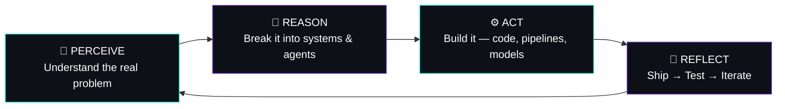

<div align="center">

```text
 _  __      _     _     
| |/ /     (_)   | |    
| ' / _ __  _ ___| |__  
|  < | '__|| / __| '_ \ 
| . \| |   | \__ \ | | |
|_|\_\_|   |_|___/_| |_|

>> autonomous_agent.exe  |  v3.0  |  region: Chennai, IN
```

[](https://git.io/typing-svg)


</div>

<br>

## `$ ./boot_sequence.sh`

```bash
> initializing krish.exe ...

[OK]    location ................. Chennai, India 🇮🇳
[OK]    core_modules .............. AI/ML · Agentic AI · Full-Stack Dev
[OK]    research_unit ............. ACTIVE — 🏆 Best Paper Award
[OK]    primary_directive ......... turn AI concepts into software that ships
[OK]    current_mode .............. actively_shipping
[WARN]  caffeine_reserve .......... CRITICAL
[OK]    system_status ............. READY_TO_BUILD 🚀

> krish.exe is now running.
```

<br>

## 🧠 How I Operate — The Agent Loop



I like building AI systems that do more than generate text.

My work sits around **agents, tool use, automation, evaluation, and the software around LLMs**.

<br>

## 🧩 Deployed Modules

### 🛡️ OpenPitStop

**An open-source quality loop for AI coding agents.**

Scans, verifies, scores, and re-checks AI-generated code across security, correctness, performance, architecture, testing, and more.

**Stack:** TypeScript · Node.js · npm · CLI tooling · automated testing · fuzzing · static analysis

→ [View OpenPitStop](https://github.com/Krish-1507/OpenPitStop)

---

### 🤖 JAMES Agent

**A modular desktop AI agent built for actual computer interaction.**

Supports multiple LLM providers and local models with tool use, MCP, browser automation, voice, file handling, desktop control, memory, and permission-based execution.

**Stack:** Python · LLM APIs · Ollama · MCP · FastAPI · Qt · Browser Automation

→ [View JAMES Agent](https://github.com/Krish-1507/JAMES_Agent)

---

### 📈 VIMO

**Vibe Marketing Operations**

An open-source autonomous marketing system that brings research, content, analytics, campaign workflows, and integrations into one AI-powered system.

**Stack:** TypeScript · React · Vite · Node.js · Fastify · SQLite · Drizzle · MCP · OAuth · WebSockets

→ [View VIMO](https://github.com/Krish-1507/VIMO_OSS)

<br>

## ⚙️ Installed Capabilities

```json
{
  "developer": "Krish J",
  "role": [
    "AI Engineer",
    "Agentic AI Builder",
    "Generative AI Developer"
  ],
  "languages": [
    "Python",
    "TypeScript",
    "JavaScript",
    "SQL",
    "React",
    "HTML/CSS"
  ],
  "ai_ml": [
    "LLMs",
    "Agentic AI",
    "RAG",
    "LangChain",
    "Hugging Face Transformers",
    "Ollama",
    "UnSloth",
    "Pandas",
    "NumPy",
    "A2A Protocols"
  ],
  "frameworks": [
    "Node.js",
    "React.js",
    "Flask",
    "Django",
    "Streamlit",
    "REST APIs",
    "MCP"
  ],
  "dev_tools": [
    "Git",
    "GitHub",
    "VS Code",
    "Vercel",
    "Firebase",
    "Claude Code",
    "Codex",
    "Cursor"
  ],
  "status": "actively_shipping"
}
```

<br>

<details>
<summary>🛠️ <b>Tech Stack</b></summary>

<br>

### Languages & Core


### AI / ML


### Frameworks & Backend


### Tools & Infrastructure


</details>

<br>

## 📡 Live Telemetry

<div align="center">


</div>

<br>

## 🏆 Achievement Unlocked

```text
┌──────────────────────────────────────────────────────┐
│  🏆  BEST PAPER AWARD                                 │
│  International Conference on Autonomous Intelligence │
│  Category: Research · Autonomous Intelligence        │
│  Status: ██████████████████████████████ 100%         │
└──────────────────────────────────────────────────────┘
```

<br>

## 📜 `git log --life --oneline`

```text
commit HEAD -> main
    Building AI agents, developer tools & automation systems

commit 2026
    🚀 OpenPitStop · JAMES Agent · VIMO

commit 2025
    Started building and shipping AI-powered products

commit 2024
    🏆 Won Best Paper Award — Int'l Conf. on Autonomous Intelligence

commit 2023
    Went deeper into LLMs, LangChain & Agentic AI

commit 2022
    Started shipping full-stack products end to end

commit root
    print("Hello, World")
```

<br>

## 📡 API — Reach The Agent

```http
GET   /social/linkedin     →  200 OK   →  linkedin.com/in/krish-j-2433672a5
GET   /social/x            →  200 OK   →  x.com/fromkrish
POST  /contact/email       →  200 OK   →  krishjeet15@gmail.com
```

<div align="center">

[](https://www.linkedin.com/in/krish-j-2433672a5/)
[](https://x.com/fromkrish)
[](mailto:krishjeet15@gmail.com)

<br>

**`"I don't just build with AI. I build AI that works."`**

</div>
