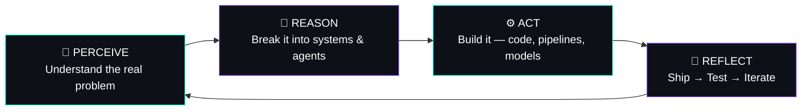

<div align="center">
 
```
 _  __      _     _     
| |/ /     (_)   | |    
| ' / _ __  _ ___| |__  
|  < | '__|| / __| '_ \ 
| . \| |   | \__ \ | | |
|_|\_\_|   |_|___/_| |_|

>> autonomous_agent.exe  |  v3.0  |  region: Chennai, IN
```

[](https://git.io/typing-svg)


</div>

<br>

## `$ ./boot_sequence.sh`

```bash
> initializing krish.exe ...

[OK]    location ................. Chennai, India 🇮🇳
[OK]    core_modules .............. Gen AI · Agentic AI · Full-Stack Dev
[OK]    research_unit ............. ACTIVE — 🏆 Best Paper Award, Int'l Conf. on Autonomous Intelligence
[OK]    primary_directive ......... turn AI concepts into software that ships
[WARN]  caffeine_reserve .......... CRITICAL
[OK]    system_status ............. READY_TO_BUILD 🚀

> krish.exe is now running.
```

<br>

## 🧠 How I Operate — The Agent Loop



I don't just write code that runs. I design **systems that think, decide, and act** — that's the difference between a script and an agent.

<br>

## 🧩 Deployed Modules

- 🤖 **JAMES Agent**
- 🛡️ **guardian-cli**
- 🎥 **VIMO**
- 📖 **RepoReader**
- 🌌 **Aether**

🔍 **[→ View all modules on github.com/Krish-1507?tab=repositories](https://github.com/Krish-1507?tab=repositories)**

<br>

## ⚙️ Installed Capabilities

```json
{
  "developer": "Krish",
  "role": ["Gen AI Engineer", "Agentic AI Builder", "Full-Stack Developer"],
  "dependencies": {
    "languages":     ["Python", "TypeScript", "JavaScript", "Java", "C++", "Dart", "PHP"],
    "ai_ml":         ["LangChain", "PyTorch", "TensorFlow", "Keras", "scikit-learn", "OpenCV", "MLflow"],
    "frontend":      ["React", "Next.js", "Vue.js", "Angular", "Flutter", "TailwindCSS", "Three.js"],
    "backend":       ["FastAPI", "Django", "Flask", "Node.js", "Express.js"],
    "databases":     ["MongoDB", "PostgreSQL", "MySQL", "Redis", "Firebase", "Supabase"],
    "cloud_devops":  ["Google Cloud", "Vercel", "Netlify", "Render", "Docker", "GitHub Actions"]
  },
  "status": "actively_shipping",
  "uptime": "always"
}
```

<details>
<summary>💊 <b>Expand full tech badge stack</b></summary>
<br>


</details>

<br>

## 📡 Live Telemetry

<div align="center">


</div>

<br>

## 🏆 Achievement Unlocked

```
┌──────────────────────────────────────────────────────┐
│  🏆  BEST PAPER AWARD                                 │
│  International Conference on Autonomous Intelligence │
│  Category: Research · Track: Autonomous Systems      │
│  Status: ██████████████████████████████ 100%         │
└──────────────────────────────────────────────────────┘
```

<br>

## 📜 `git log --life --oneline`

```text
commit HEAD -> main (2025)
    Building autonomous multi-agent systems, full-time

commit 2024
    🏆 Won Best Paper Award — Int'l Conf. on Autonomous Intelligence

commit 2023
    Went all-in on LangChain, LLMs & Agentic AI

commit 2022
    Started shipping full-stack products end to end

commit root (20XX)
    print("Hello, World")
```

<br>

## 📡 API — Reach The Agent

```http
GET   /social/linkedin     →  200 OK   →  linkedin.com/in/krish-j-2433672a5
GET   /social/x            →  200 OK   →  x.com/fromkrish
POST  /contact/email       →  200 OK   →  krishjeet15@gmail.com
```

<div align="center">

[](https://www.linkedin.com/in/krish-j-2433672a5/)
[](https://x.com/fromkrish)
[](mailto:krishjeet15@gmail.com)

<br>

**`"I don't just build with AI — I build AI that builds."`**

</div>
